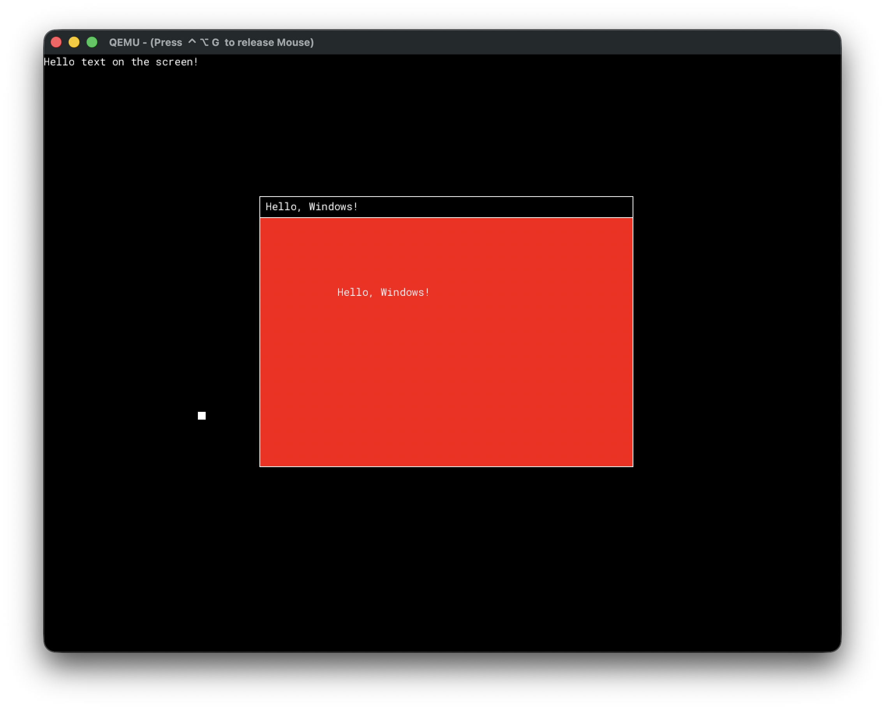

# z-os

Toy Kernel and Operating System, written in C for ARM64.



## Prerequisites

* QEMU
* Docker

## Usage

First build development environment Docker image:

```bash
./scripts/build_image.sh
```

Then build and run the project in QEMU:

```bash
./run.sh
```
